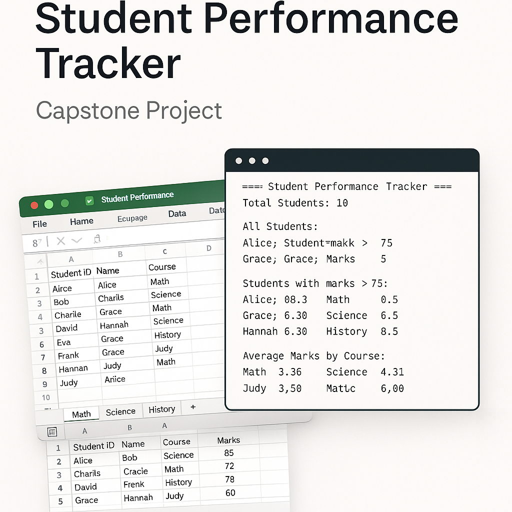

<p align="center">
  
</p>


# 🎓 Student Performance Tracker

A Java-based capstone project that allows educational institutes to track and analyze student performance using JDBC, Java 8 features (Streams, Lambdas), and Apache POI for Excel reporting.

---

## 🧰 Technologies Used

- Java 8+
- Maven
- H2 Database (in-memory / file-based)
- JDBC
- Apache POI (Excel generation)
- Java Collections & Stream API

---

## 🎯 Project Objective

To build a Java console application that:
- Connects to a database and fetches student data
- Performs filtering, sorting, and grouping using Streams and Lambdas
- Calculates average scores per course
- Exports the results to an Excel file

---

## 📁 Project Structure

    src/
    ├── main/
    │   ├── java/
    │   │   └── com/studenttracker/
    │   │       ├── main/            # Main class
    │   │       ├── model/           # Student POJO
    │   │       ├── dao/             # JDBC logic
    │   │       ├── service/         # Business logic
    │   │       ├── config/          # Config loader
    │   │       └── util/            # Excel exporter
    │   └── resources/
    │       ├── application.properties
    │       └── schema.sql

---

## ⚙️ Setup Instructions

1. **Clone the Repository**
   ```bash
       git clone https://github.com/NaralaJithendra/StudentPerformanceTracker
       cd student-performance-tracker
    ```

2. **Add Apache POI Dependency**

   Make sure your `pom.xml` includes:

   ```xml
   <dependency>
       <groupId>org.apache.poi</groupId>
       <artifactId>poi-ooxml</artifactId>
       <version>5.2.3</version>
   </dependency>
   ```

3. **Database Setup**

   The app uses **H2** in-memory/file DB and auto-runs the script located at:

   ```
   src/main/resources/schema.sql
   ```

4. **Configure `application.properties`**

   Example configuration:

   ```properties
   db.url=jdbc:h2:mem:studentdb;DB_CLOSE_DELAY=-1;INIT=RUNSCRIPT FROM 'classpath:schema.sql'
   db.username=sa
   db.password=
   output.excel.path=StudentPerformanceReport.xlsx
   ```

5. **Run the Application**

   You can run `Main.java` from your IDE or using the terminal:

   ```bash
   mvn compile exec:java -Dexec.mainClass="com.studenttracker.main.Main"
   ```

---

## 🧪 Features

* Fetch student data from the H2 database
* Filter students by score threshold (e.g., > 75)
* Group students by course
* Calculate average marks by course
* Sort students by marks (desc)
* Export report to Excel
* Optional: Multiple sheets by course

---
## 📤 Sample Excel Output

* Sheet: `Student Performance` or one sheet per course
* Columns: `Student ID | Name | Course | Marks`

---

## 👨‍💻 Author

[Narala Jithendra](https://github.com/NaralaJithendra)
<br>
Java Developer.


<p align="center">
    <a href="https://github.com/NaralaJithendra"></a>
    </p>

